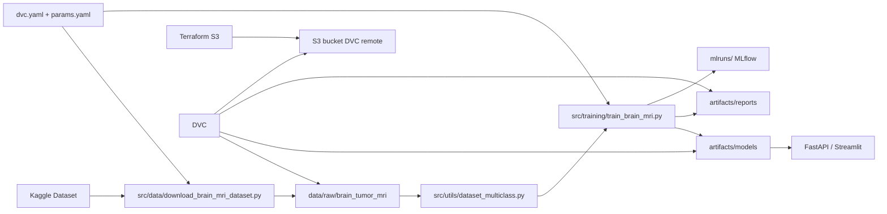

# Architecture MedVision

## 1. Vue d'ensemble

MedVision combine quatre couches principales :
- **ML training** pour entraîner des modèles de vision médicale ;
- **MLOps** pour tracer, reproduire et stocker les artefacts ;
- **Serving** pour exposer l'inférence ;
- **Infra** pour provisionner le stockage du remote DVC.



## 2. Couche Training

### Workflow Brain MRI

Le flux le plus exploitable du dépôt est :
1. téléchargement du dataset Kaggle ;
2. chargement des images multi-classes ;
3. entraînement TensorFlow/Keras ;
4. génération de métriques ;
5. log MLflow ;
6. pipeline DVC.

### Scripts clés

- `src/data/download_brain_mri_dataset.py`
- `src/training/train_brain_mri.py`
- `src/utils/dataset_multiclass.py`
- `src/evaluation/metrics_multiclass.py`

## 3. Couche MLOps

### MLflow

MLflow est utilisé dans les scripts d'entraînement pour :
- créer les expériences ;
- enregistrer les paramètres ;
- tracer les métriques ;
- stocker les artefacts du run.

### DVC

DVC complète MLflow en pilotant le pipeline et les remotes de données.

### Terraform

Terraform provisionne le bucket S3 destiné au remote DVC.

## 4. Couche Serving

### FastAPI

`src/api/main.py` expose une API de prédiction minimale.

### Streamlit

`streamlit_app.py` permet une démonstration simple côté UI.

## 5. Observation importante

Le serving actuel est encore aligné avec la logique historique **chest X-ray** plutôt qu'avec le flux **Brain MRI**. Le dépôt gagnerait à séparer explicitement :
- `serving/chest_xray`
- `serving/brain_mri`

## 6. Architecture cible recommandée

```text
src/
├── api/
│   ├── chest_xray/
│   └── brain_mri/
├── data/
├── datasets/
├── evaluation/
├── inference/
├── models/
├── preprocessing/
├── training/
└── utils/
```

## 7. Conclusion

Ce dépôt est une base MLOps/ML crédible pour un portfolio ou un refactor d'ingénierie, avec une vraie valeur pédagogique sur :
- l'entraînement ;
- le tracking MLflow ;
- les pipelines DVC ;
- le stockage remote ;
- le packaging applicatif.
